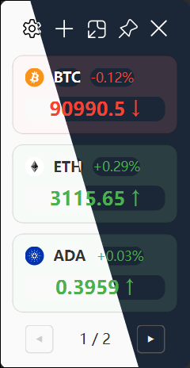

# Crypto Monitor

A modern, elegant, and cross-platform cryptocurrency price monitor built with Python and PyQt6, featuring a stunning Fluent Design interface.



## Features

- **Real-time Monitoring**: Live price updates from OKX via WebSocket connection.
- **Fluent Design UI**: A beautiful, modern interface with Acrylic effects, supporting both Light and Dark themes.
- **Advanced Alert System**:
    - **Price Thresholds**: Alerts when price goes above, below, or touches a target.
    - **Step Alerts**: Trigger alerts at regular price intervals (e.g., every $1,000) or percentage changes (e.g., every 5% daily change).
    - **Flexible Reminders**: Configure alerts to trigger once or repeat with a customizable cooldown period.
- **Alert Management**: Dedicated interface to view, edit, and manage alerts for each trading pair.
- **Desktop Integration**:
    - **System Tray**: Minimize to tray to keep running in the background.
    - **Native Notifications**: Receive Windows native notifications for price alerts.
    - **Draggable UI**: Custom frameless windows that can be dragged and positioned anywhere.
- **Customization**:
    - **Theme Manager**: Switch between Light and Dark modes.
    - **Trading Pairs**: Easily add or remove cryptocurrency pairs.
    - **Network**: Built-in proxy support for restricted network environments.

## Usage

1. **Running the App**:
    ```bash
    uv run main.py
    ```
2. **Managing Pairs**:
    - Click `+` to add a new trading pair (e.g., `BTC-USDT`).
    - Right-click a card to access the context menu:
        - **Add Alert**: Create a new price alert.
        - **View Alerts**: Manage existing alerts for the pair.
    - Double-click a card to open the trading page in your browser.
3. **Settings**:
    - Click the Settings icon (Gear) to configure:
        - **Appearance**: Toggle themes or transparency.
        - **Network**: Configure HTTP/Socks5 proxy.
        - **notification**: Manage notification preferences.

## Technology Stack

- **Python 3.10+**
- **PyQt6**: Cross-platform GUI toolkit.
- **QFluentWidgets**: Modern Fluent Design components for PyQt.

## Credits

- [QFluentWidgets](https://github.com/zhiyiYo/PyQt-Fluent-Widgets) for the amazing UI components.

