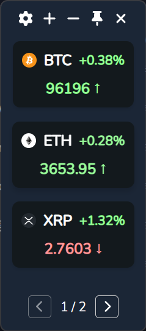

# Crypto Monitor

[](https://github.com/shiquda/crypto-monitor/releases)
[](https://www.python.org/)
[](https://github.com/shiquda/crypto-monitor/actions)
[](https://github.com/zhiyiYo/PyQt-Fluent-Widgets)

A modern, elegant, and cross-platform cryptocurrency price monitor built with Python and PyQt6, featuring a stunning Fluent Design interface.

<p align="center">
  
</p>

> **Note**: This application has only been tested on **Windows**. MacOS and Linux compatibility hasn't been verified yet. We welcome your feedback and testing on these platforms!

## Features

- **Fluent Design UI**: A beautiful, modern interface with Acrylic effects, supporting both Light and Dark themes.
- **Real-time Monitoring**: Live price updates from OKX/Binance via WebSocket connection.
- **Advanced Alert System**: Powerful price alert features with native system notifications and optional sounds, including:
    - **Price Thresholds**: Alerts when price goes above, below, or touches a target.
    - **Step Alerts**: Trigger alerts at regular price intervals (e.g., every $1,000) or percentage changes (e.g., every 5% daily change).
- **Mini Chart**: Quick-view chart for monitoring price changes at a glance.
- **Customization**:
    - **Theme Manager**: Switch between Light and Dark modes.
    - **Trading Pairs**: Easily add or remove cryptocurrency pairs.
    - **Network**: Built-in proxy support for restricted network environments.

## Usage

1. **Installing the App**:

As a user, you can install the latest release of the software from the [Releases](https://github.com/shiquda/crypto-monitor/releases) page.

As a developer, you can use the following command to run the app:

```bash
uv run main.py
```

2. **Managing Pairs**:
- Click `+` to add a new trading pair (e.g., `BTC-USDT`).
- Right-click a card to access the context menu:
    - **Add Alert**: Create a new price alert.
    - **View Alerts**: Manage existing alerts for the pair.
- Double-click a card to open the trading page in your browser.

3. **Pin to Top**:
- Click the Pin icon *(Pin)* to pin/unpin the window to the top of the screen.

4. **Settings**:
- Click the Settings icon *(Gear)* to configure.

For detailed usage instructions, please refer to the User Manual:

[English](docs/user_manual_en.md) | [简体中文](docs/user_manual_zh.md)

## Technology Stack

- **Python 3.10+**
- **PyQt6**: Cross-platform GUI toolkit.
- **QFluentWidgets**: Modern Fluent Design components for PyQt.

## Credits

- [QFluentWidgets](https://github.com/zhiyiYo/PyQt-Fluent-Widgets) for the amazing UI components.
- Data Providers:
    - [OKX](https://www.okx.com/)
    - [Binance](https://www.binance.com/)
