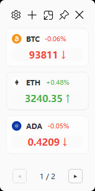
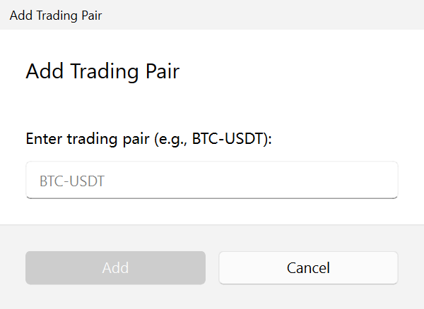
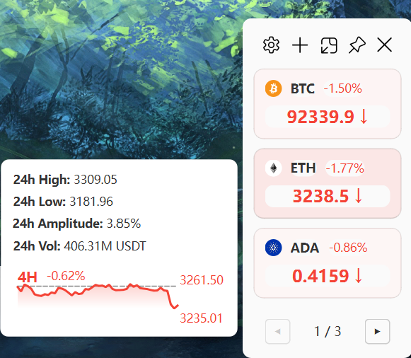
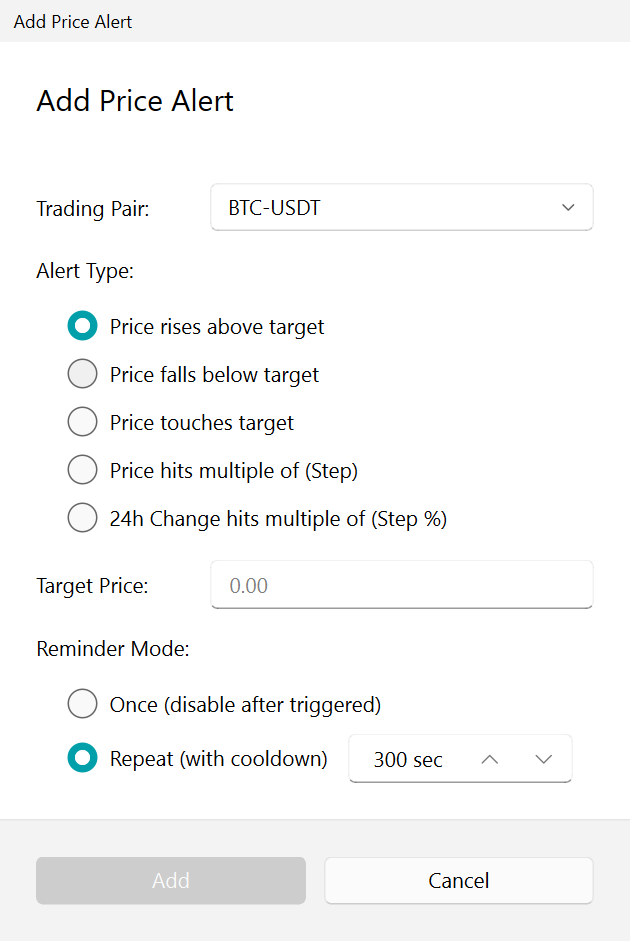
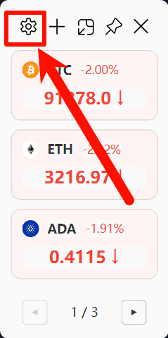

# Crypto Monitor User Manual

Welcome to Crypto Monitor, a modern and elegant cryptocurrency price monitor designed for your desktop.

## 1. Introduction
Crypto Monitor allows you to track real-time cryptocurrency prices from major exchanges like OKX and Binance directly from your desktop. It features a stunning Fluent Design interface that blends seamlessly with Windows 11.

### Key Features
- **Real-time Monitoring**: Live price updates via WebSocket.
- **Fluent Design**: Beautiful UI with Acrylic effects, supporting Light and Dark themes.
- **Smart Alerts**: Set price thresholds and step alerts to stay informed.
- **Desktop Integration**: System tray support, native notifications, and always-on-top mode.
- **Customizable**: minimal interface with resizeable and draggable windows.



## 2. Installation & Setup

### Prerequisites
- Windows 10 or 11 (recommended).
- Internet connection.
- Python 3.10+ (if running from source).

### Running the Application

You can find the pre-built executable in Github Release page.

If you have the executable (EXE):
1. Double-click `Crypto Monitor.exe`.

If running from source:
1. Ensure you have `uv` or `pip` installed.
2. Install dependencies: `uv sync` or `pip install -r requirements.txt`.
3. Run the application:
   ```bash
   uv run main.py
   ```

## 3. Getting Started

### The Main Interface
The main window is compact and displays your tracked cryptocurrency pairs as cards.
- **Toolbar (Top)**: Access Settings, Add Pair, Pin window, Minimize, and Close.
- **Crypto Cards**: Each card shows the symbol, current price, and 24h percentage change.
- **Pagination (Bottom)**: If you have many pairs, navigate through pages using the dots.

### Adding a Trading Pair
1. Click the **(+) Add** button in the toolbar.
2. Enter the trading pair symbol (e.g., `BTC-USDT` or `ETH-USDT`).
3. Click **Add**. The new pair will appear on the main card list.



### Removing a Pair
1. Hover over the card you want to remove.
2. Click the **Trash bin** icon that appears on the card.

## 4. Using Features

### Viewing Details
- **Hover**: Hover over a card to see detailed 24h statistics (High, Low, Volume).
- **Chart**: A mini price chart is displayed in the hover card.
- **Open Exchange**: Double-click a card to open the trading pair on the exchange website in your default browser.



> Note: You can manage the content of the hover card in Settings > Appearance > Hover Card.

### Managing Alerts
You can set alerts to be notified of price movements.
1. **Right-click** on a crypto card.
2. Select **Add Alert**.
3. Configure your alert:
   - **Target Price**: Set a specific price to trigger an alert.
   - **Condition**: Choose `Above`, `Below`, or `Touch`.
   - **Frequency**:
     - **Once**: Alert triggers once and then disables.
     - **Repeating**: Alert triggers every time the condition is met (with a cooldown).
   - **Step Alerts**: Notify every time the price moves by a certain amount (e.g., every $100 rise).



To manage existing alerts, right-click a card and select **View Alerts**.

### Always on Top
Click the **Pin** icon in the toolbar to keep the Crypto Monitor window above all other windows.

## 5. Settings

Click the **Gear** icon in the toolbar to open Settings.



### General
- **Data Source**: Switch between **Binance** and **OKX**. Note that data availability may vary.
- **Language**: Switch between English and Chinese.

### Appearance
- **Theme**: Toggle between **Light** and **Dark** mode.
- **Dynamic Background**: Enable/Disable background opacity changes based on price intensity.

### Network
- **Proxy**: Configure a proxy if you are on a restricted network. Supports HTTP and SOCKS5.

### About
- View version information.
- **Open Log Directory**: Quickly access log files for debugging.

